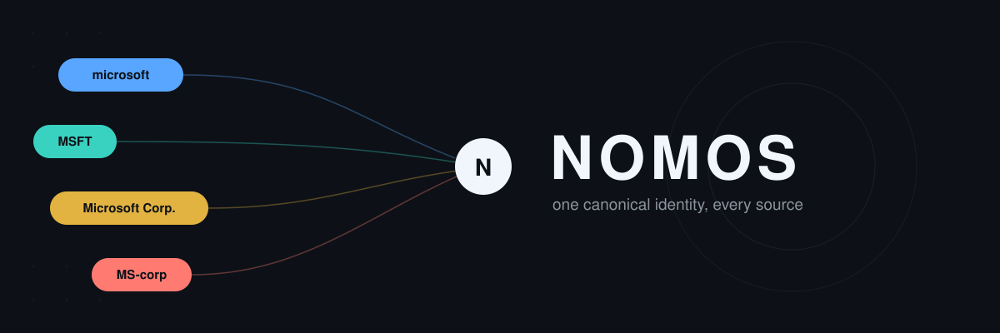

# Nomos

**[Search the live index](https://b-mx.github.io/Nomos/)**

Nomos is a community-maintained mapping from vendor and product names, as
they appear across disparate security data sources, to a single canonical
identity per vendor and per product.

## Why

Every security data source names vendors and products differently: NVD
CPE uses `microsoft:windows_server`, CISA KEV writes "Microsoft
Corporation", endoflife.date uses `windows-server`. Nomos gives every
vendor and product a stable canonical id and records each source's alias
for it, so downstream tools (CVE ingestion, asset inventory matching,
vulnerability correlation) can resolve "these three strings are the same
thing" without re-deriving the mapping themselves.

Nomos is source-agnostic: it doesn't belong to or favor NVD, CISA, OSV, or
any other single source.

## Data model

- **Vendor** (`vendors/<id>/vendor.yaml`) — a canonical vendor, with a
  stable `id`, display `name`, and a list of source aliases.
- **Product** (`vendors/<id>/products/<id>.yaml`) — a canonical product
  nested under its vendor, with a `type` (`hardware`, `appliance`,
  `firmware`, `os`, `software`, `library`), tags, optional network
  `services`, and aliases.
- **Alias** — `{source, value, confidence}` (plus optional `ecosystem` for
  package-ecosystem sources like PyPI/npm). `confidence: curated` means a
  human verified it; `auto` means it came from an unverified match.
- **Tag** (`taxonomy/tags.yaml`) — the closed set of category labels a
  product can carry (e.g. `database`, `webserver`).

**Self-vendored products** — packages with no real company behind them —
use the same slug for both the vendor directory and the product, e.g.
`vendors/redis/vendor.yaml` and `vendors/redis/products/redis.yaml`.

## Using the published index

On every merge to `main`, the full mapping is published to GitHub Pages:

- `index/aliases.json` — every vendor and product, flattened, with all
  aliases.
- `index/by-source/<source>.json` — just the aliases relevant to one
  source, for consumers that only care about one feed.

A worked example of the shape (built from this repo's seed data) is
committed at `examples/aliases.json` so you can see the format without a
Pages deploy.

The [search site](https://b-mx.github.io/Nomos/) lets you check whether a
vendor/product is already mapped before opening a PR.

## Quickstart: adding an entry

See `CONTRIBUTING.md` for the full walkthrough. Short version:

1. `uv run tools/validate.py` to confirm the repo is clean before you start.
2. Add `vendors/<id>/vendor.yaml` (or reuse an existing vendor) and
   `vendors/<id>/products/<id>.yaml`.
3. Only use tags already in `taxonomy/tags.yaml` — a new tag needs its own
   PR first.
4. `uv run tools/validate.py` again, then open a PR.

## License

MIT — see `LICENSE`.
